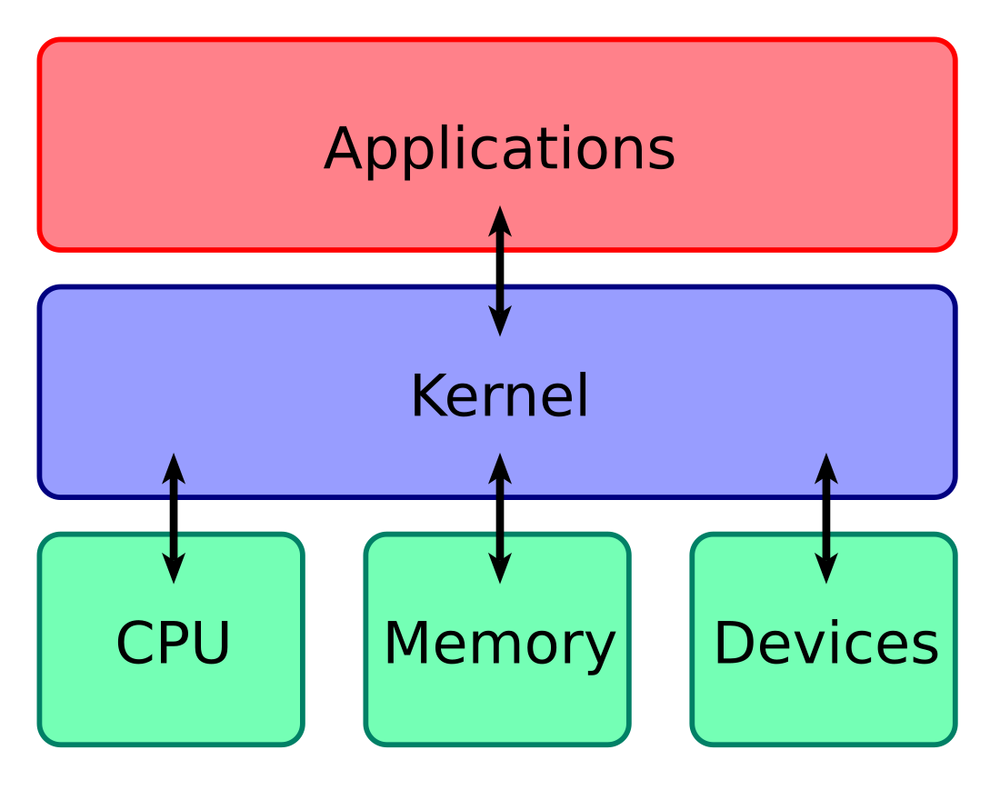

## 1. Ce este DOCKER- ul?

-  un  software virtualizat
-  dezvoltarea și implementarea aplicațiilor este mult mai ușoară
- Docker-ul împachetează aplicația + librăriile + configurațiile + mediul de execuție într-o singură imagine portabilă
- portabil, ușor de partajat și distribuit

### Ce probleme a rezolvat Docker-ul?

Practic nu mai trebuie să faci anumite configurări pentru sistemul tău de operare.

---

## 2. Virtual Machine(VM) vs Docker

 - Astfel orice sistem de operare are 2 layere importante, mai exact `OS Application Layer` și  `OS Kernel`
 

- practic layer-ul de kernel comunică cu partea hardware(CPU, memory etc), fiind cel care face legătura între hardware și aplicații.
- în layer-ul de aplicații se află, practic aplicații propriu zise, cum ar fi Chrome, Word etc.

#### Docker
- Docker-ul virtualizeaza layer-ul  de aplicații doar.
- practic când rulezi container-ul, acesta conține aplicațiile din layer-ul de aplicații al sistemului de operare și alte aplicații instalate în vârful layerului de aplicații, cum ar fi pentru Java la runtime sau în alte limbaje cum ar fi python.

#### VM
- folosește amble layere, practic are complet acces la sistemul de operare.
- când descarci o imagine, atunci se folosește kernel-uș propriu zis.

---

## 3. Diferența dintre Docker și VM
