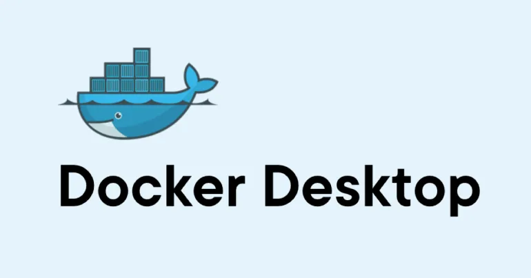
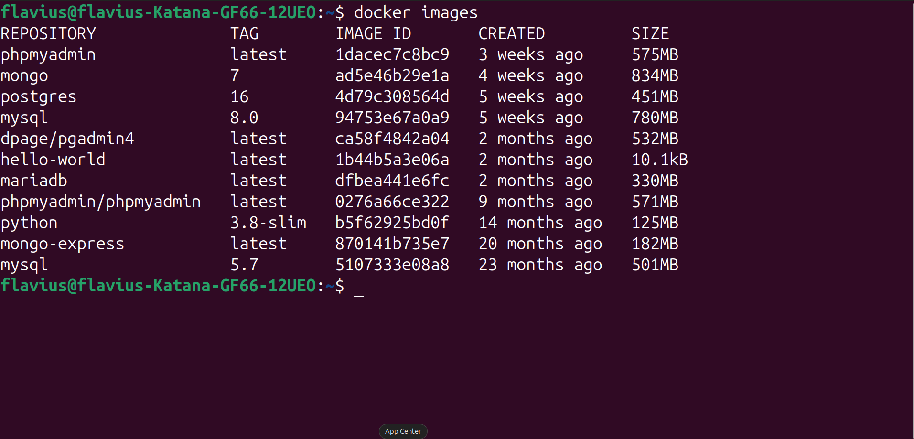
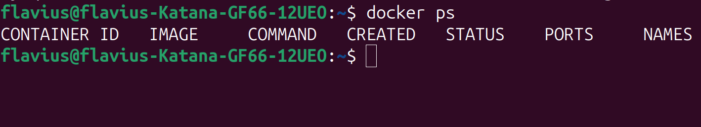
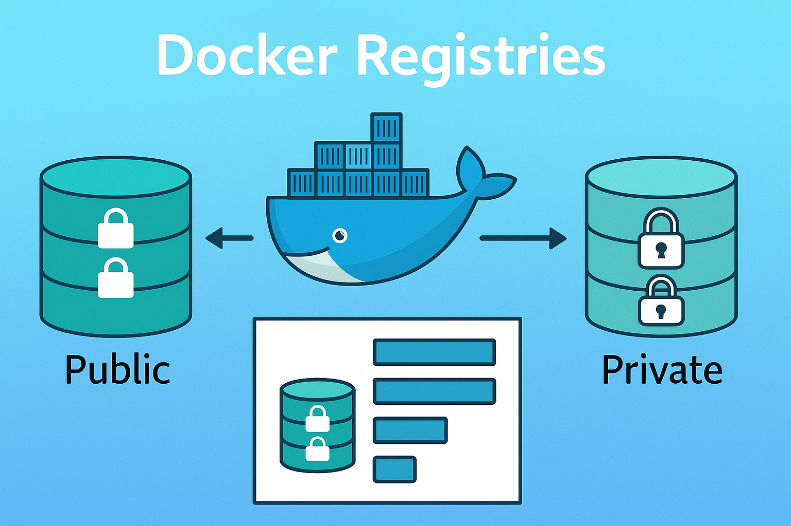
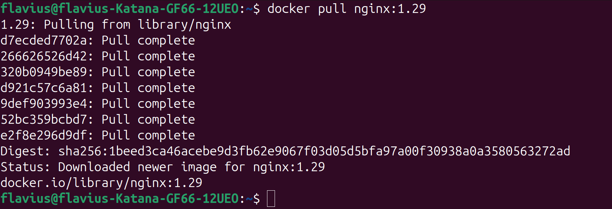
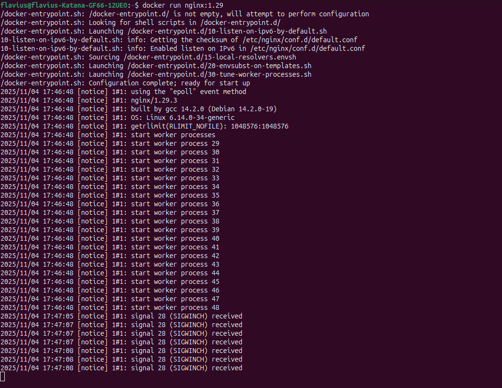
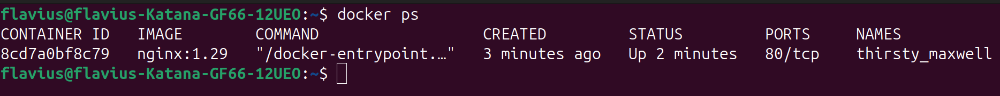
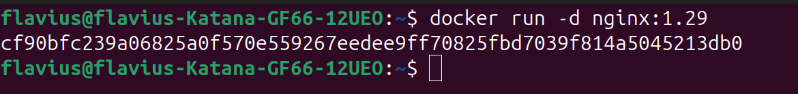
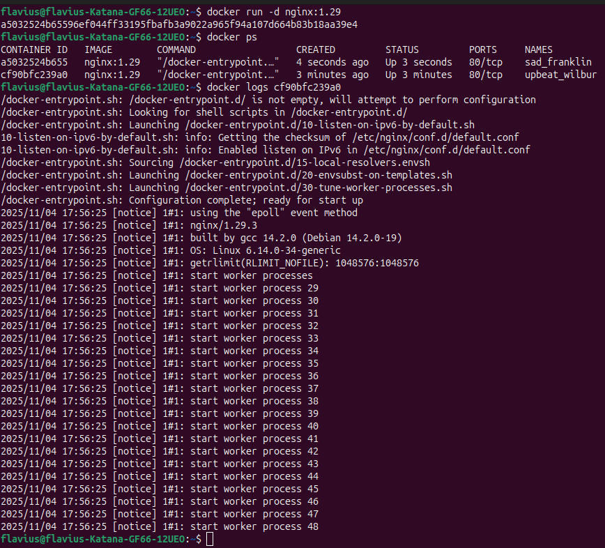

## 1. Ce este DOCKER- ul?

-  un  software virtualizat
-  dezvoltarea și implementarea aplicațiilor este mult mai ușoară
- Docker-ul împachetează aplicația + librăriile + configurațiile + mediul de execuție într-o singură imagine portabilă
- portabil, ușor de partajat și distribuit

### Ce probleme a rezolvat Docker-ul?

Practic nu mai trebuie să faci anumite configurări pentru sistemul tău de operare.

---

## 2. Virtual Machine(VM) vs Docker

 - Astfel orice sistem de operare are 2 layere importante, mai exact `OS Application Layer` și  `OS Kernel`
 

- practic layer-ul de kernel comunică cu partea hardware(CPU, memory etc), fiind cel care face legătura între hardware și aplicații.
- în layer-ul de aplicații se află, practic aplicații propriu zise, cum ar fi Chrome, Word etc.

#### Docker
- Docker-ul virtualizeaza layer-ul  de aplicații doar.
- practic când rulezi container-ul, acesta conține aplicațiile din layer-ul de aplicații al sistemului de operare și alte aplicații instalate în vârful layerului de aplicații, cum ar fi pentru Java la runtime sau în alte limbaje cum ar fi python.

#### VM
- folosește amble layere, practic are complet acces la sistemul de operare.
- când descarci o imagine, atunci se folosește kernel-uș propriu zis.

---

## 3. Diferența dintre Docker și VM

 - imaginile de pe **Docker** sunt mult mai mici, pentru că folosesc practic doar un singur layer din sistemul de operare, pe când pentru VM sunt mai mari pentru că folosește ambele layere.

- Dimensiunea imaginilor în **Docker** pot ajunge de ordinul MB, pe când în VM pot ajunge de ordinul GB.


 
 - O altă mare diferență ar viteza. Practic pentru un **VM** poate lua câteva minute să pornească, pe când **Docker-ul** are nevoie de câteva secunde, deoarece acesta folosește de fiecare dată kernelul hostului, pe când **VM-ul** kernelul propriului calculator.
- Compatibilitatea poate reprezenta un alt factor esențial. Astfel o **VM** este compatibilă cu orice sistem de operare, pe când **Docker-ul** nu este la fel de compatibil, fiind conceput pentru Linux. 

### Oare de ce apare o astfel de incompatibilitate? 

- Răspunsul este unul simplu, practic având layer-ul de aplicații pentru Linux, avem nevoie de Kernelul de Linux, nu de windows/MAC OS, astfel de aici apare incompatinilitatea. 
-  O rezolvare a fost practic **Docker Desktop**, care un ***Hypervisor***, care oferă o compatibilitate cu **Windows** și **MAC OS** pentru a putea rula imaginia pe Linux fără vreo problemă.



---
## 4. Docker Images vs Docker Containers

- Docker-ul poate împacheta în artefact, cum ar fi zip, tar, jar etc și să trimită direct către server imaginea.

#### Docker image

-  este un artefact al aplicației executabile.
-  conține codul sursă al aplicației.
-  îmbunătățiri adăugate pentru varibile, cum ar fi crearea de directoare, fișiere etc.

#### Docker container

-  pornește aplicația.
-  rulează o instanță a imaginii.
-  din aceeași imagine se pot rula mai multe containers.


Comenzi: 

- Pentru listarea tuturor imaginiilor:

```bash
flavius@flavius-Katana-GF66-12UEO:~$ docker images
```



- Listarea tuturor containers care ruleaza:

```bash
flavius@flavius-Katana-GF66-12UEO:~$ docker ps
```



---

## 5. Docker Registries

- reprezintă un storage pentru toate Docker images de tip artefact. Un exemplu ar putea fi Docker Hub-ul.



- o altă comandă esențială ar putea fi **pull**. 

##### docker pull {nume_imagine}:{tag/versiune}

```bash
flavius@flavius-Katana-GF66-12UEO:~$ docker pull nginx:1.29
```

- practic clientul va contacta Docker Hub că vrea imaginea nginx cu tagul specificat, totul local.


- pentru ce curioși pot folosi comanda images.

---
## 6. Run an Image

- dacă dorim să rulăm o imagine avem nevoie de comanda run.

##### docker run {nume_imagine}:{tag/versiune}

```bash
flavius@flavius-Katana-GF66-12UEO:~$ docker run nginx:1.29
```

- practic știm că un container a rulat cu succes atunci când vedem logurile.



- **Atenție**!!! Terminalul este practic blocat. Dacă deschidem o altă fereastră pentru un nou terminal și vom tasta comanda **ps** vom vedea ce containere rulează. Pentru  a opri rularea apasă combinația de taste ***CTRL + C***, iar procesul moare.



-  Pentru a evita ***detached mode*** sau blocarea terminalului adăugam ***-d***.

##### docker run -d {nume_imagine}:{tag/versiune}

```bash
flavius@flavius-Katana-GF66-12UEO:~$ docker run -d nginx:1.29
```



- practic rezultatul opținut este id-ul full al container-ului. Astfel cu comanda ***ps*** verificăm containerele care rulează și cu ***logs*** logurile din container.



---

## 7. Port Binding