**1.** Descărcați un dataset de pe  
[https://developer.imdb.com/non-commercial-datasets/](https://developer.imdb.com/non-commercial-datasets/) : **name.basics.tsv.gz**

**2.** Creați tabela corespunzătoare într-o bază de date **MySQL** și încărcați datele de mai sus.

**3.** Faceți un studiu de caz asupra căutării în această tabelă:
- căutare după nume care se termină cu „onnor”
- căutare după nume care conțin „alley”
    

- **Scopul exercițiului** este să reduceți timpul de căutare sub 1 secundă pentru exemplele de mai sus.
- Baza de date trebuie să fie replicată în **2 instanțe slave**.
- Se va nota ordinea în care ați făcut operațiile (de exemplu, dacă ați creat mai întâi slave-urile sau ați încărcat informațiile în baza de date master mai întâi).

---

**Trebuie să încărcați:**
- fișierul `docker-compose.yml` / fișierul `Dockerfile` (dacă nu ați folosit docker compose);
- un fișier TXT cu toate comenzile pe care le-ați rulat în shell de MySQL (gen `SELECT * FROM ...`) → `mysql-history.txt`;
- un fișier TXT cu toate comenzile pe care le-ați rulat în linie de comandă (inclusiv `docker compose up -d`) → `shell-history.txt`;
- un fișier TXT cu o scurtă explicație a ceea ce ați făcut (și de ce, cum ați redus timpul de căutare etc.) → `explicatii.txt`.

# Rezolvare

```bash
flavius@flavius-Katana-GF66-12UEO:~/Documents/ABD/test1$ code docker-compose.yaml
```

```yaml
# Use root/example as user/password credentials
services:

  db: #serverul de baze de date (MariaDB)
    image: mariadb:latest #pentru ultima versiune
    container_name: test_abd_imdb
    restart: always
    environment:
      MARIADB_ROOT_PASSWORD: toor
      MARIADB_DATABASE: imdb
      MARIADB_USER: user_imdb
      MARIADB_PASSWORD: user_pass
    ports:
      - 3306:3306
    volumes:
      - db_data:/var/lib/mysql #folderul din container unde MariaDB își ține toate datele (tabele, indexuri, etc.)

  adminer: #interfata web (client) pentru DB
    image: adminer
    restart: always
    ports:
      - 8080:8080
    environment:
      ADMINER_DEFAULT_SERVER: db
    depends_on:
      - db
  
volumes:
  db_data:
```

```bash
docker compose down -v //in caz ca avem si alte containere pornite
```

```bash
docker compose up -d
docker compose ps
```

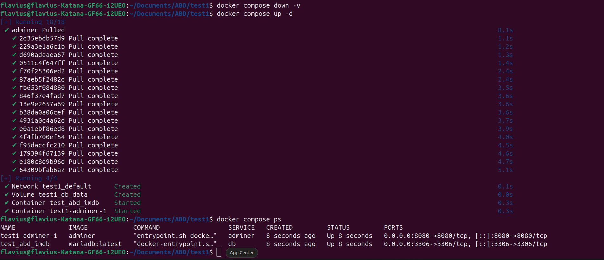

Astfel o sa avem:

- test_abd_imdb → MariaDB
- test1-adminer-1 → Adminer

Accesam `http://localhost:8080/`:

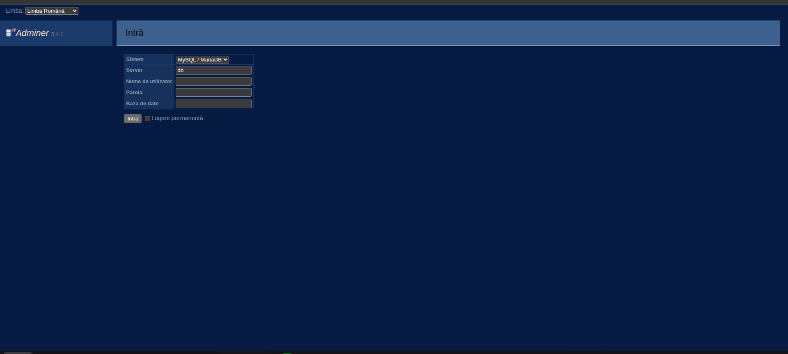

- Sistem: lasă MySQL / MariaDB
- Server: db
- Nume de utilizator: user_imdb
- Parolă: user_pass
- Baza de date: poți lăsa gol sau scrii imdb


Click pe imdb:
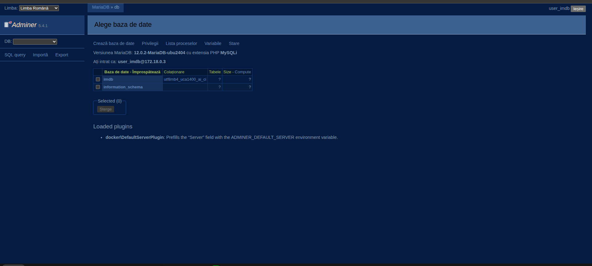

Click SQL query:
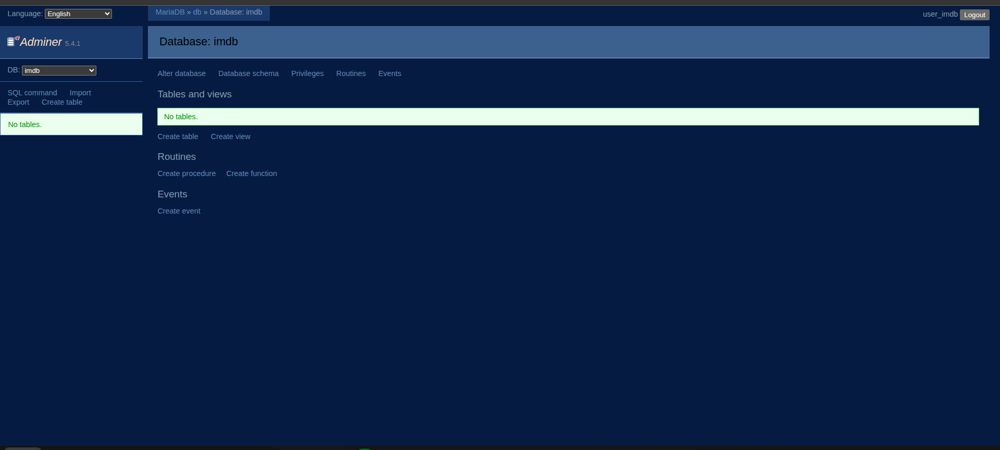

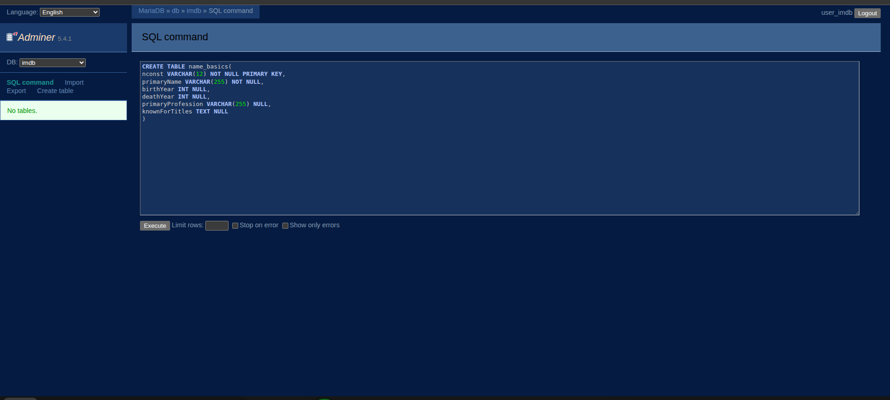

```SQL
CREATE TABLE name_basics(
	nconst VARCHAR(12) NOT NULL PRIMARY KEY,
	primaryName VARCHAR(255) NOT NULL,
	birthYear INT NULL,
	deathYear INT NULL,
	primaryProfession VARCHAR(255) NULL,
	knownForTitles TEXT NULL
)
```

Rezultatul corect:
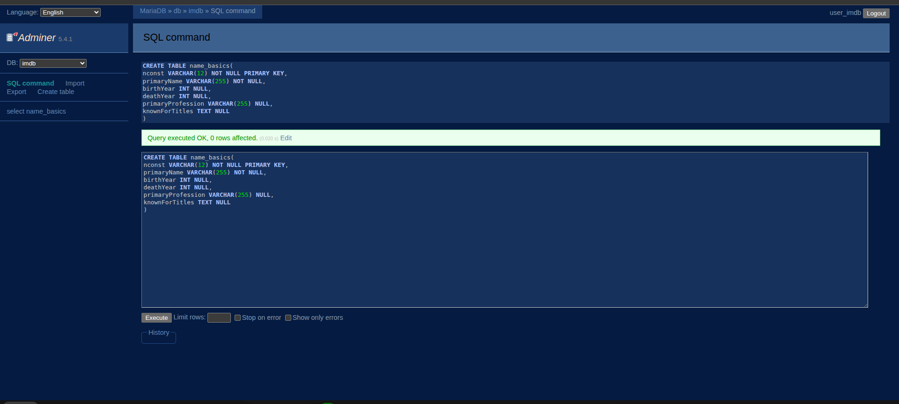

Urmează să descărcăm arhiva dorită. O să facem un director special:

```bash
mkdir data
cd data
wget https://datasets.imdbws.com/name.basics.tsv.gz
```

```bash
gunzip name.basics.tsv.gz

ls -lh
```

Copiază fișierul în containerul MariaDB. Pe **host** (nu în container), din orice folder:

```bash
docker cp ~/Documents/ABD/test1/data/name.basics.tsv test_abd_imdb:/tmp/name.basics.tsv
```

### Intrare în MariaDB folosind _docker compose_

```bash
docker compose exec db bash
```

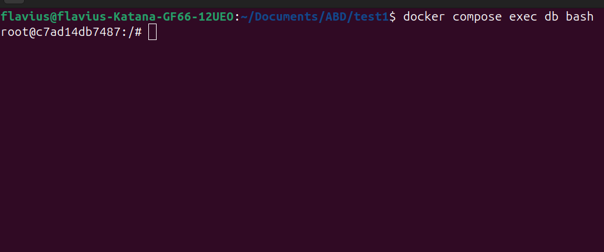
Din container, intri în MariaDB ca `user_imdb`:

```bash
mariadb --local-infile=1 -u user_imdb -p imdb
# parola: user_pass
```

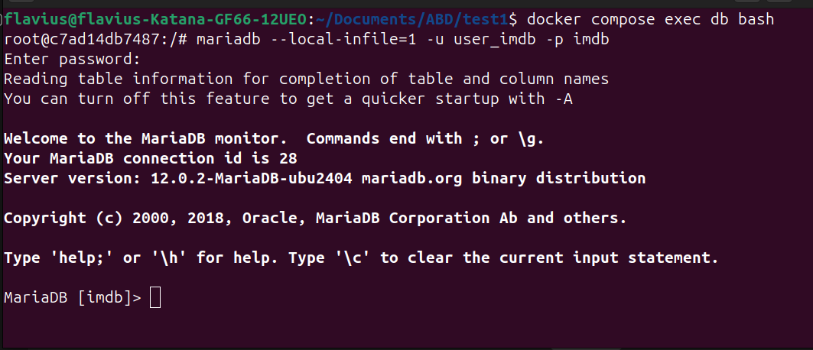

```bash
LOAD DATA LOCAL INFILE '/tmp/name.basics.tsv'
INTO TABLE name_basics
FIELDS TERMINATED BY '\t'
LINES TERMINATED BY '\n'
IGNORE 1 LINES
(
  nconst,
  primaryName,
  birthYear,
  deathYear,
  primaryProfession,
  knownForTitles
);
```

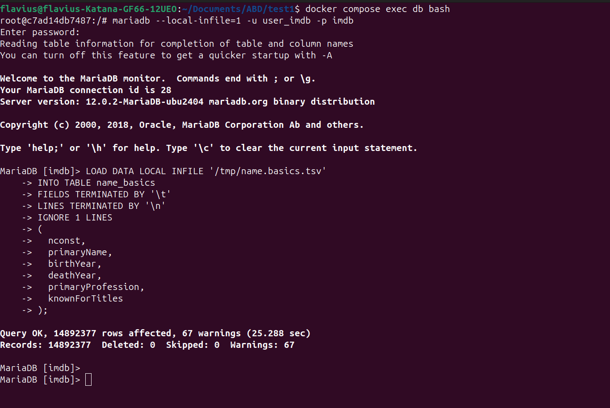

```SQL
SELECT COUNT(*) FROM name_basics;
```

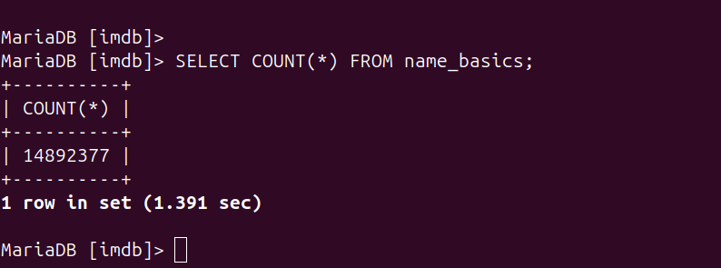

```SQL
SELECT * FROM name_basics WHERE primaryName LIKE '%onnor' LIMIT 20;
```

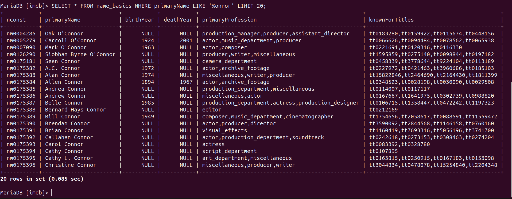

```SQL
SELECT * FROM name_basics WHERE primaryName LIKE '%alley%' LIMIT 20;
```

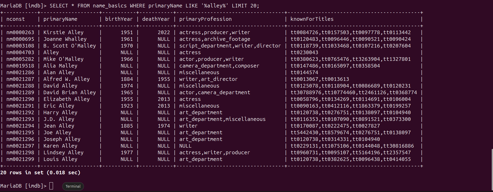


### Când pui indexurile **ÎNAINTE**:

- Tabel **mic/mediu**.
- Scrieri **puține, constante** (aplicație normală, nu import mare).
- Ai nevoie de **PK/UNIQUE** ca să blochezi dublurile chiar la import.

### Când pui indexurile **DUPĂ**:

- Faci un **import mare (LOAD DATA, milioane de rânduri)**.
- Vrei ca importul să meargă **cât mai repede**.
- Workflow:
    1. Creezi tabelul cu minimul necesar (de obicei doar PK).
    2. Faci `LOAD DATA`.
    3. Apoi `CREATE INDEX ...` pe coloanele de căutare.

În cazul tău cu `name_basics` (14M rânduri) → **import fără index pe `primaryName`, apoi index după** (exact ce faci acum).

```SQL
CREATE INDEX idx_name_primaryName ON name_basics(primaryName);
```

