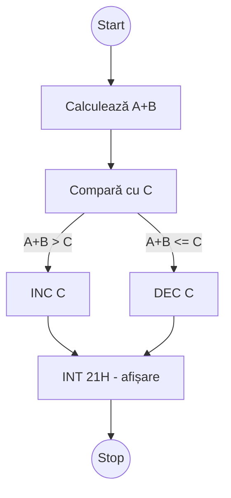

---

## 🔹 1️⃣ Citirea de la tastatură  

Citirea unui caracter introdus de la tastatură și salvarea lui în AL.
```asm
MOV AH, 1
INT 21H
MOV A, AL
```

---

## 🔹 2️⃣ Afișarea pe ecran  

Afișăm valoarea unei variabile pe ecran sub formă de caracter ASCII.
```asm
A DB 7
MOV AH, 2
MOV DL, A
INT 21H
```

---

## 🔹 3️⃣ Flag Register  

| Flag | Nume | Descriere |
|------|------|------------|
| **SF** | Sign Flag | Setat dacă rezultatul este negativ |
| **ZF** | Zero Flag | Setat dacă rezultatul este zero |
| **CF** | Carry Flag | Setat dacă apare transport (împrumut) |

---

## 🔹 4️⃣ Instrucțiuni de salt condiționat  

| Instrucțiune | Condiție | Descriere |
|---------------|-----------|------------|
| **JS**  | SF = 1 | Salt dacă semnul este negativ |
| **JNS** | SF = 0 | Salt dacă semnul este pozitiv |
| **JZ**  | ZF = 1 | Salt dacă rezultatul este zero |
| **JNZ** | ZF = 0 | Salt dacă rezultatul ≠ 0 |
| **JC**  | CF = 1 | Salt dacă carry = 1 |
| **JNC** | CF = 0 | Salt dacă fără carry |

---

## 🔹 5️⃣ Instrucțiunea CMP  

Instrucțiunea `CMP` compară doi operanzi și setează flagurile în funcție de rezultat.

```asm
CMP OP1, OP2
; Efect: OP1 - OP2 (fără salvarea rezultatului)
```

### Rezultate posibile:
- **OP1 < OP2** → SF = 1  
- **OP1 = OP2** → ZF = 1  
- **OP1 > OP2** → SF = 0 și ZF = 0  

---

## 🧮 Exercițiu

### ✅ Cerință:

Se evaluează expresia:
```asm
if ((A + B) > C) then
  C++
else
  C--
```

- data
```asm
A DB 3
B DB 4
C DB 5
```

- code
```asm
MOV AL, A       ; AL ← A
ADD AL, B       ; AL ← A + B
MOV BL, C       ; BL ← C
CMP AL, BL      ; comparăm (A+B) cu C
JS  MINUS       ; dacă A+B < C → salt la eticheta MINUS
INC C           ; altfel C = C + 1
JMP FINAL

MINUS:
DEC C           ; C = C - 1

FINAL:
MOV AH, 2
INT 21H
```

---

## 💡 Observații

- `INT 21H` → întreruperea DOS pentru operații I/O:  
  - **AH = 1** → citire caracter de la tastatură  
  - **AH = 2** → afișare caracter pe ecran  
- `CMP` doar compară, **nu modifică valorile** operandului.  
- Instrucțiunile `JS`, `JZ`, `JNZ` folosesc flagurile din rezultatul `CMP`.  
- Flagurile sunt actualizate automat după operațiile aritmetice.  

---

## 🧠 Logică schematică (Mermaid)



---

✅ **Rezultat final:**  

- Programul decide dacă rezultatul lui `A+B` este mai mare sau mai mic decât `C`  
  și modifică `C` corespunzător folosind întreruperile DOS.
	
