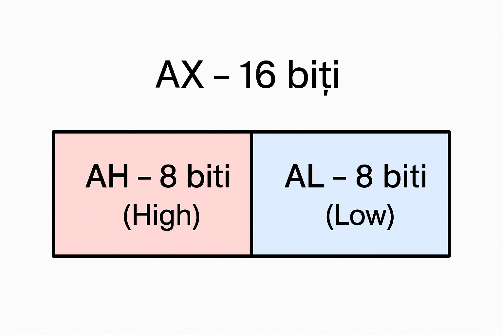
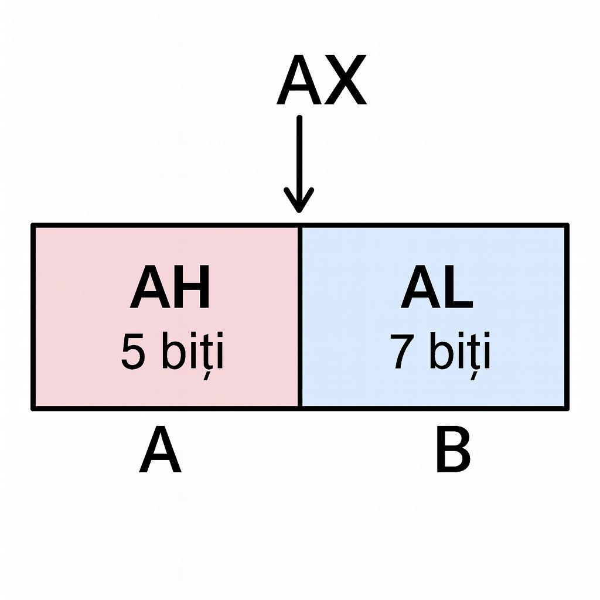

# 🧠 Registers

### Registre generale
Vom lucra cu registrele de bază ale microprocesorului (AX, BX, CX, DX, etc.).




---

# 💾 Variables

### 🔹 Cum declarăm o variabilă?

```asm
nume_variabila DB valoare_initiala
nume_variabila DW valoare_initiala
nume_variabila DD valoare_initiala
nume_variabila DP valoare_initiala
```

### 🔹 Dimensiuni aferente pentru variabile

| Directive | Dimensiune | Tip de date |
| --------- | ---------- | ----------- |
| `DB`      | 8 biți     | Byte        |
| `DW`      | 16 biți    | Word        |
| `DD`      | 32 biți    | Double Word |
| `DP`      | 64 biți    | Quad Word   |
## 📘 Exemple de declarații în Assembly

### 🔹 Variabile simple

```asm
A  DB  7      ; variabilă pe 8 biți
A1 DB  3      ; tot 8 biți
```


### 🔹 Vector

```asm
A2 DW 7, 6, 4, 5 ; 
```

-  fiecare element din vector este pe 16 biti(2 octeti/ 2 bytes)
-  in memorie, ele sunt stocate secvențial pe câte 2 octeți fiecare
-  Reprezentare grafică a lui A2 în memorie

| Adresă | Conținut (DW) | Valoare |
| ------ | ------------- | ------- |
| 1000h  | A2[0]         | 7       |
| 1002h  | A2[1]         | 5       |
| 1004h  | A2[2]         | 6       |
| 1006h  | A2[3]         | 4       |


---
#  🔗 Constante

###### 💡 **Sintaxă generală**

```asm
nume_constanta EQU valoare
```

###### 📘 **Exemple**

```asm
PI       EQU 3.14
MAX_VAL  EQU 255
PORT_A   EQU 80H
```

###### ⚠️ **Diferență față de variabile:**

| Tip       | Declarație | Se alocă memorie? | Poate fi modificată? |
| --------- | ---------- | ----------------- | -------------------- |
| Variabilă | `A DB 7`   | ✅ Da              | ✅ Da                 |
| Constantă | `A EQU 7`  | ❌ Nu              | ❌ Nu                 |

---

# ⚙️ Instrucțiuni Assembly

## 🔹 Structura generală a unei instrucțiuni

	etichetă(opțional) nume_instrucțiune operanzi ; comentariu (opțional)

###### 📘 **Exemplu**

```asm
START: MOV AX, BX   ; copiază conținutul lui BX în AX
```


## 🧩 Instrucțiunea `MOV`

### 📘 Descriere

Instrucțiunea `MOV` copiază conținutul dintr-un operand sursă (**source**) într-un operand destinație (**destination**).

### 🔹 Sintaxă

```asm
MOV OP1, OP2
```

- **OP1** = destinația (unde se scrie)
- **OP2** = sursa (de unde se citește)
-  sensul este **`dest ← src`**

### ⚠️ Reguli importante

- Nu se pot muta **două variabile din memorie direct între ele** (nu `MOV var1, var2`)
- Trebuie să fie întotdeauna unul dintre operanzi **într-un registru**
- Dimensiunile operanzilor trebuie să fie **egale** (8 biți cu 8 biți, 16 cu 16)


### 📘 **Exemplu**

- data
```asm
A db 5
B db 7
```

- code
```asm
MOV AH A
MOV AL B
MOV A AL
MOV B AH
```



---
## ➕ ADD — adunare

Instrucțiunea `ADD` adună valoarea sursei (**OP2**) la destinație (**OP1**).

**Sintaxă:**
```asm
ADD OP1, OP2 ; OP1 ← OP1 + OP2
```


## ➖SUB — scădere 

Instrucțiunea SUB scade valoarea sursei (OP2) din destinație (OP1). 

Sintaxă:
```asm
SUB OP1, OP2 ; OP1 ← OP1 - OP2
```


# 🧮 Exercițiu: (A + B) – (C – D)

## 📦 Date:

```asm
A DB 5 
B DB 6 
C DB 8 
D DB 9
```

## ⚙️ Cod Assembly:

```asm
MOV AL, A      ; AL ← A 
ADD AL, B      ; AL ← A + B  
MOV AH, C      ; AH ← C 
SUB AH, D      ; AH ← C - D  
SUB AL, AH     ; AL ← (A + B) - (C - D)
```

## 🧠 Explicație pas cu pas:

1. Se mută înregistrările în **registrele AL și AH**.
2. Se efectuează adunarea **A + B** → rezultatul în AL.
3. Se calculează **C - D** → rezultatul în AH.
4. Se scade rezultatul din primul: **(A + B) - (C - D)** → final în AL.

---

## 🔼 INC — incrementare

Instrucțiunea `INC` crește valoarea operandului cu 1.

**Sintaxă:**
```asm
INC OP1    ; OP1 ← OP1 + 1
```

## 🔽 DEC — decrementare

Instrucțiunea `DEC` scade valoarea operandului cu 1.

**Sintaxă:**
```asm
DEC OP1    ; OP1 ← OP1 - 1
```

## ✖️ MUL — înmulțire

Instrucțiunea `MUL` înmulțește conținutul lui `AL` (sau `AX`) cu operandul indicat.

**Sintaxă:**
```asm
MUL OP1    ; AX ← AL * OP1   (pentru 8 biți)
```

### 🔹 Exemplu:
- data
```asm
A DB 3 
B DB 7 
```

- code
``` asm
MOV AL, A   ; AL ← 3 
MUL B       ; AX ← AL * B = 3 * 7 = 21
```

## ➗ DIV — împărțire

Instrucțiunea `DIV` împarte conținutul lui `AX` la operandul indicat.

**Sintaxă:**
```asm
DIV OP1    ; AL ← cat, AH ← rest
```

### 🔹 Exemplu:

- data
```asm
A DB 32 
B DB 6  
```

- code
```asm
MOV AL, A   ; AL ← 32 
DIV B       ; AL ← 5 (cat), AH ← 2 (rest)
```

---
# 🧮 Exerciții — Instrucțiuni aritmetice (Assembly)

---

## 1️⃣ Exercițiu: (A++ * B) / C

### 📦 Date:
```asm
A DB 3
B DB 7
C DB 2
```

### ⚙️ Cod:
```asm
INC A         ; A = A + 1
MOV AL, A 
MUL B         ; AX = (A+1) * B 
DIV C         ; AL = (A+1)*B / C
```
---

## 2️⃣ Exercițiu: ((A++) * B) / (C * A)

### 📦 Date:
```asm
A DB 2 
B DB 8 
C DB 2
```

### ⚙️ Cod:
```asm
INC A
MOV AL, A
MUL B          ; AL = (A+1)*B

MOV BL, AL
MOV AL, C
DEC A
MUL A          ; AL = C*A
MOV CL, AL

MOV AL, BL
DIV CL         ; (A+1)*B / (C*A)
```

---

## 3️⃣ Exercițiu: [(A++) * C]^2

### 📦 Date:
```asm
A DB 3 
B DB 4
```


### ⚙️ Cod:
```asm
INC A
MOV AL, A
MUL C           ; AL = (A+1)*C
MUL AL          ; AX = [(A+1)*C]^2
```

---

## 💡 Observații

- `INC` și `DEC` afectează doar un singur operand (nu folosesc registru sursă).
- `MUL` folosește implicit **AL/AX** pentru multiplicare.
- `DIV` pune **catul în AL**, **restul în AH**.
- Este recomandat să lucrezi cu valori mici, pentru a nu depăși 8 biți (**255**).