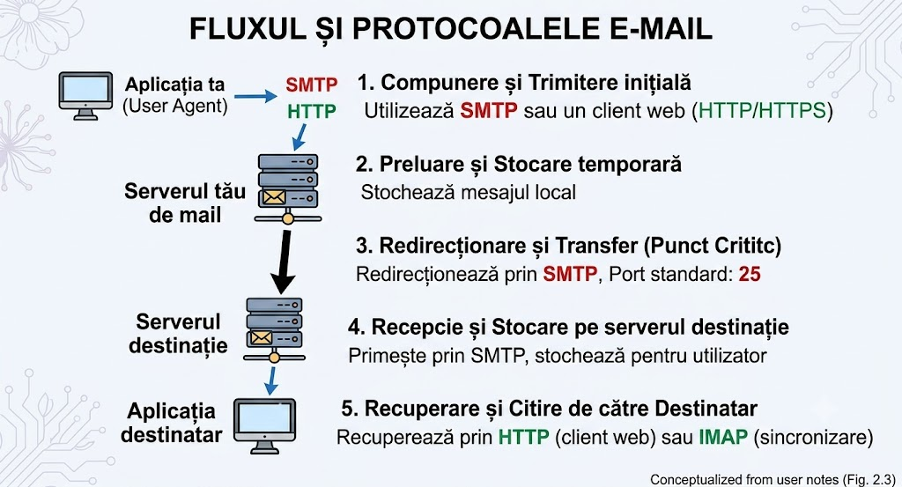

## EMAIL = Electronic Mail in the Internet

## 1. Pașii:

#### Componente: 
- user agents
- mail servers
- SMTP

#### User agents:
- outlook
- gmail
- apple mail
- etc

#### Scenariu Alice to Bob:

1. Alice composes & sends.
2. User agents -> Alice's server (**SMTP or HTTP**).
3. Alice's server -> Bob's server (**SMTP (TCP port 25)**).
4. Bob's mailbox filled.
5. Bob retrieves his mail.

- Folosim 2 servere intermediare care sunt pornite, pentru a evita pierderea mesajelor în caz că server-ul lui Bob este oprit, server-ul va ține într-o coadă mesajul până când va reporni celălalt server ți va reîncarca livrarea la fiecare 30 de minute.

---

## 2. Protocolul SMTP (Simple Mail Transfer Protocol)

- SMTP este protocolul care transferă mesajele între servere (și de la client la serverul său)
- face practic ”PUSH” la mesaje de la emițător la server sau de la server la server.
- folosește ***portul 25** pentru comunicarea ***server-to-server***.
- folosește ***portul 587*** pentru comunicarea ***user-to-server***.
- ***ATENȚIE:*** o limitare pentru SMTP este că folosește conținut ASCII pe 7 biți, ceea ce înseamnă că nu putem să trimitem conținut media/video.
- ***Soluție:*** este codificarea la început, după care deocodificarea la destinație.
- Comenzi de bază în dialogul SMTP: `HELO`, `MAIL FROM`, `RCPT TO`, `DATA`, `QUIT`.

---

## 3. MIME - Multipurpose Internet Mail Extensions

- o modalitate de a depăși limitarea mesajelor codificate în ASCII.
- un standard, care traduce aceste fișiere binare în caractere text (Base 64), înainte de a le trimite și le decodează la destinație.

---

## 4. Capcană de examen: Comenzi SMTP vs. Headerele Mesajului

- **Comenzile SMTP** (ex: `MAIL FROM:`, `RCPT TO:`) fac parte din _protocolul de rețea_ și spun serverului cum să ruteze mesajul (ca informațiile de pe un plic poștal).

- **Header lines** (ex: `From:`, `To:`, `Subject:`) fac parte din _mesajul în sine_ (RFC 5322), apar după comanda `DATA` și sunt ceea ce vezi tu pe ecran (ca textul din interiorul scrisorii). Ele pot fi diferite de comenzile SMTP, motiv pentru care spammerii pot falsifica expeditorul aparent.

---

## 5. Accesarea Mailului: HTTP, IMAP și POP3 (PULL Protocols)

#### Deoarece SMTP face doar _push_, ai nevoie de alte protocoale pentru a "trage" (PULL) emailurile de pe server ca să le citești:

###### **IMAP (Internet Mail Access Protocol):**
- este folosit de aplicații dedicate precum Outlook, Apple Mail, etc și descarcă mail-urile pe ***port 993*** (TCP).
- marele avantaj este că păstrează mesajele pe server și sincronizează folderele pe toate dispozitivele tale (dacă citești un mail pe telefon, apare ca citit și pe laptop).

###### POP3:
- protocol vechi care descarcă mesajul pe un singur PC și îl șterge de pe server.
- nu oferă sincronizare între dispozitive.

###### **HTTP (Webmail):**
- când trimiți un mail din aplicația de pe PC pentru trimitere se inițializează o conexiune SMTP (***port 587***) și una IMAP (***port 993***) pentru a primi.
- de pe browser se deschide o conexiune HTTPS (***port 443***). Procesul SMTP se întâmplă între servere.

---

## 6. Cele 3 Porturi ale Emailului pe care trebuie să le știi

- **Port 25:** Folosit pentru _Server-to-Server_ (Classic SMTP).
- **Port 587:** Folosit pentru _Client Submission_ (când Outlook-ul tău trimite mesajul către serverul tău, necesitând autentificare).
- **Port 993:** Folosit pentru _IMAP_ (citirea mesajelor de pe server).

