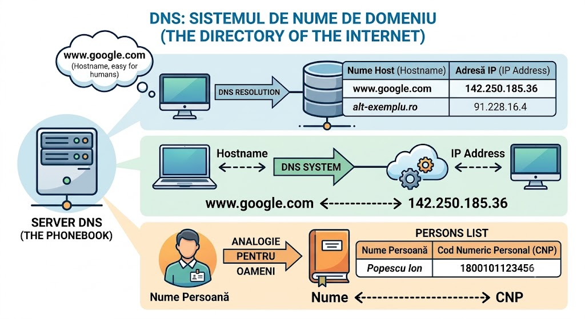
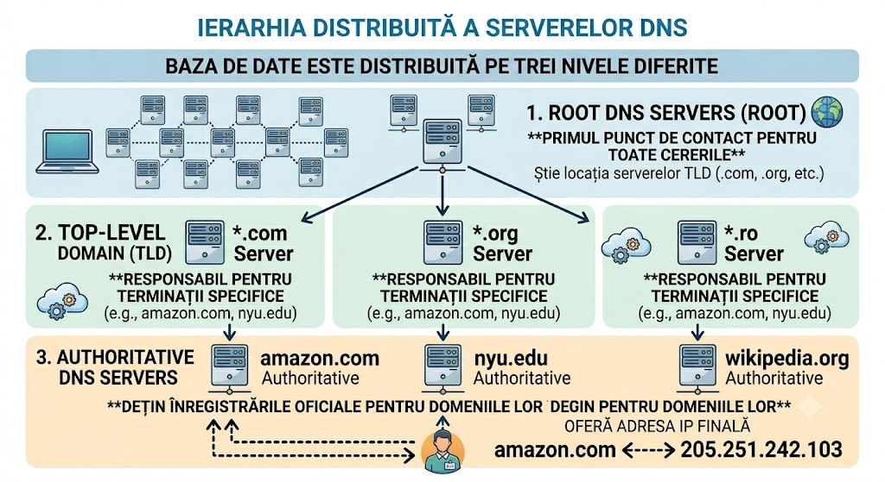

## DNS = Domain Name System

- Face translatarea între un nume și un număr.

- DNS este un protocol la nivelul aplicație.
- DNS-ul folosește **UDP pe portul 53**.
- DNS-ul presupune 2 componente esențiale:
	1. o bază de date distribuită.
	2. o aplicație client care să fie capabilă să interogheze baza de date distribuita.
- routerele și infrastructura de rețea preferă adresele IP pentru a ruta pachete.
- DNS-ul funcționează ca o punte care face traducere de la nume la IP.

---

## 1. De ce NU este centralizat DNS-ul?

- DNS-ul este gândit ca fiind o arhitectură distribuită și ierarhizată, pentru a putea evita întârzierile de timp (latența) din cauza distanței geografice sau volumul de trafic (_Traffic Volume_) ar fi imposibil de gestionat pe o singură mașină sau baza de date ar fi mult prea mare și imposibil de actualizat constant (_Maintenance_) sau etc.

---

## 2. Hostname-to-IP Translation

1) Browser extracts hostname.
2) Passes it to DNS client.
3) DNS client sends a query.
4) DNS client receives a reply.
5) TCP connection established.

---

## 3. Ierarhia serverelor

- pentru DNS, baza de date este împărțită sau mai bine spus distribută pe trei nivele diferite:
	1) ***Root DNS Servers:*** primul punct de contact care știe unde sunt serverele pentru domeniile de nivel înalt (TLD).
	2) ***Top-Level Domain (TLD) Servers:*** responsabil pentru terminații precum: `.com`, `.org`, `.ro`.
	3) ***Authoritative DNS Servers:*** serverele organizației care dețin înregistrările oficiale pentru host-urile lor: `amazon.com`, `nyu.edu`, etc.

- **ATENȚIE:** **Local DNS Server** (setat de ISP-ul tău prin DHCP) nu face parte strict din ierarhia globală, ci funcționează ca un proxy. El este cel care preia interogarea ta și navighează prin cele 3 niveluri de mai sus pentru a-ți găsi răspunsul.

---

## 4. Interogări: Recursive vs. Iterative

- ***Recursive Query:*** Clientul face o cerere către server-ul Local DNS, iar acesta face toată treabă și în final returnează IP-ul final. Host-ul așteaptă pur și simplu rezultatul.
- ***Iterative Query:*** Local DNS-ul parcurge ierarhia de servere de la **Root DNS Servers**, la **Top-Level Domain (TLD) Servers**, la **Authoritative DNS Servers**, primid de la fiecare o trimitere la următorul server, până găsește răspunsul.

---

## 5. Caching && TTL

- pentru a evita parcurgerea totală a ierarhiei de fiecare dată, serverele DNS stochează răspunsurile în memorie (caching).
- avantajul este reducerea ***latenței*** și ***traficului în rețea***.
- TTL (time-to-live): este timpul în care o înregistrare este considerată validă în cache înainte de a fi ștearsă pentru a asigura consistența datelor.

---

## 6. Tipurile de înregistrări (Resource Records - RRs)

- O înregistrare are formatul `(Name, Value, Type, TTL)`.
- EX: `(foo.com, mail.bar.foo.com, MX)`

#### Type A
- leagă un ***hostname*** de o ***adresă IP***.
- Face maparea standard. `Name` = un hostname, `Value` = Adresa IP
- ex: `(relay.1.bar.foo.com,145.37.93.126,A)`.

#### Type NS
- indică numele serverului DNS autorizat pentru domeniu.
- `Name` = un domeniu, `Value` = Numele serverului _Authoritative_ pentru acel domeniu (arată spre cine deține înregistrările A)
- `(foo.com,dns.foo.com,NS)`

#### Type CNAME
- este un alias, leagă un nume de alt nume.
- Folosit pentru _aliasing_. `Value` reprezintă numele canonic (numele tehnic real) pentru un alias (`Name`)
- `(foo.com,relay1.bar.foo.com,CNAME)`

#### Type CNAME
- identifică server-ul de mail pentru un domeniu.
- Este similar cu CNAME, dar este folosit strict pentru a oferi numele canonic al unui **server de email** (Mail server)
- `(foo.com,mail.bar.foo.com,MX)`

---

## 7. Securitatea (Vulnerabilități)

- Cele mai cunoscute atacuri asupra DNS-ului sunt atacurile de tip DDoS (inundarea serverelor cu trafic), MITM (Man-in-the-Middle) și, foarte important, **DNS Cache Poisoning** (atacul prin care cineva injectează o înregistrare IP falsă într-un server DNS, redirecționând utilizatorii către site-uri malițioase). Defensiva împotriva acestor falsificări criptografice se face printr-o extensie numită **DNSSEC**.