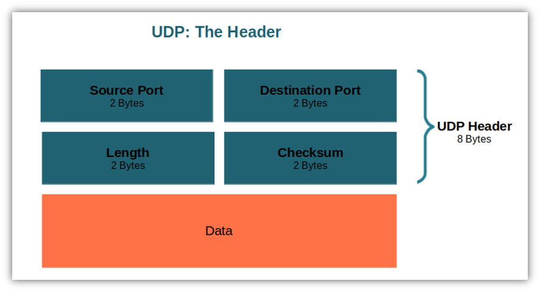

## 1. Rolul nivelului transport

- asigură o comunicare logică între procesele aplicațiilor care rulează pe gazde diferite.
- comparativ cu ***nivelul rețea***, care asigură comunicarea logică de la gazdă la gazdă, ***nivelul transport*** extinde acest serviciu pentru a asigura livrarea de la proce la proces.
- nivelul transport este implementat doar pe ***end-systems*** (laptopuri, servere).

---

## 2. Multiplexarea și demultiplexarea

- deoarece un calculator rulează mai multe aplicații simultan, pachetele trebuie direcționate corect.

#### Multiplexarea
- mai multe intrări la o ieșire.
- reprezintă acțiunea de a colecta date de la ***multiple socket-uri***, de a adăuga ***antetul transport*** și de a pasa segmentele rezultate către ***nivelul rețea***.

# SAU

- **Multiplexare (la expeditor):** Colectarea datelor de la mai multe socket-uri, adăugarea header-ului de transport (care include porturile) și trimiterea lor.

---

#### Demultiplexarea
- acțiunea prin care nivelul transport examinează câmpurile din antetul unui segment sosit pentru a identifica socket-ul corect și a livra datele.

# SAU

- **Demultiplexare (la receptor):** Citirea portului destinație din pachetul sosit și livrarea datelor către socket-ul corespunzător.

---

#### Socket UDP
- este indentificat printr-un 2-Tuple: `(IP destination, Port destination)`.
- Asta înseamnă că dacă doi clienți diferiți trimit mesaje către același IP și port al unui server, ambele mesaje vor intra în _același_ socket (ex. un singur socket pentru toate cererile DNS).

#### Socket TCP
- este identificat de un **4-tuple**: `(IP sursă, Port sursă, IP destinație, Port destinație)`
- Chiar dacă portul destinație este același (ex. portul 80 pentru Web), serverul va crea un socket _diferit_ și dedicat pentru absolut fiecare client conectat.

---

## 3. Protocolul UDP (User Datagram Protocol)

- UDP este un protocol extrem de simplu, nesigur (_unreliable_) și fără conexiune (_connectionless_)
	1) **Viteză și lipsa delay-ului de setup:** Nu pierde timp cu _3-way handshake-ul_ folosit de TCP. Începe să trimită date instant.
	
	2) **Control mai fin:** Nu are "congestion control" (controlul congestiei). TCP încetinește transmisia dacă rețeaua e aglomerată, pe când UDP "pompează" date fără oprire, fiind ideal pentru apeluri video/voce unde viteza e mai importantă decât pierderea câtorva biți.
	
	3) **Nu menține "state":** Neavând buffere mari sau timere de conexiune, un server UDP poate suporta mult mai mulți clienți simultan.
	
	4) **Header mult mai mic:** UDP are un overhead de doar 8 bytes (comparativ cu TCP care are minim 20). 

---

## 4. Structura Header-ului UDP și Checksum-ul

* Header-ul UDP este de fix **8 bytes** și conține doar 4 câmpuri (a câte 16 biți fiecare):
	1. **Source Port** (Portul expeditorului, util pentru ca receptorul să știe unde să răspundă).
	2. **Destination Port** (Portul receptorului, folosit pentru demultiplexare).
	3. **Length** (Lungimea totală, inclusiv datele).
	4. **Checksum** (Folosit pentru detecția erorilor).

- **Checksum-ul** adună toate cuvintele de 16 biți din segment și le face complementul față de 1. Dacă la destinație suma totală dă numai biți de 1 (`1111 1111 1111 1111`), înseamnă că nu sunt erori. Acest checksum există direct în UDP datorită **Principiului End-to-End**: verificarea erorilor trebuie făcută la capetele transmisiei, deoarece un pachet se poate corupe chiar și în memoria routerelor, unde protocoalele de nivel inferior (precum Ethernet) nu te pot proteja.

