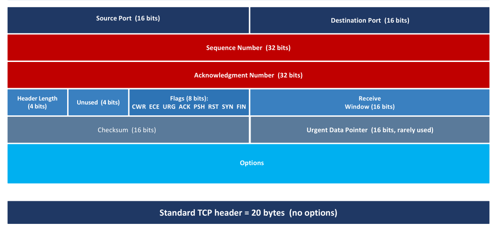

## 1. Proprietățile Fundamentale ale Conexiunii TCP

- **Point-to-Point și Full-Duplex:** TCP funcționează strict între un singur expeditor și un singur receptor (fără multicast). Datele pot circula simultan în ambele direcții pe aceeași conexiune (_full-duplex_).
- **Starea (State) există DOAR la endpoint-uri:** Routerele din centrul rețelei nu știu absolut nimic despre conexiunile TCP. Toate bufferele (Send Buffer și Receive Buffer) și variabilele sunt alocate doar pe PC-ul tău și pe server.
- **MSS (Maximum Segment Size):** Reprezintă cantitatea maximă de _date de aplicație_ pe care o poate conține un segment, fără a include headerele TCP/IP

---

## 2. Structura Segmentului și Numerele de Secvență

- Header-ul TCP are minimum **20 de bytes**

- TCP nu numără segmente, ci numără **BYTE cu BYTE** (_Byte-Stream Numbering_).

- Câmpul **Sequence Number** reprezintă poziția primului byte de date din acel segment.

- **Acknowledgment Number (AckNum):** Este un sistem **cumulativ** și indică strict secvența _următorului byte pe care receptorul îl așteaptă_. Orice date venite "out-of-order" sunt puse în buffer, dar AckNum-ul nu avansează până nu e umplut golul.

- **Flag-uri esențiale (1 bit):**
	- **SYN** (folosit doar la stabilirea conexiunii).
	- **FIN** (folosit la închiderea conexiunii).
	- **ACK** (este setat la 1 în aproape toate pachetele, exceptând primul SYN).
	- **RST** (Reset - folosit pentru a avorta imediat și forțat o conexiune)

---

## 3. Managementul Timerelor și Exponential Backoff

- TCP calculează timpul de așteptare (_TimeoutInterval_) folosind o formulă de medie exponențială ponderată: `TimeoutInterval = EstimatedRTT + 4 × DevRTT`. Acel `4 × DevRTT` acționează ca o marjă de siguranță.

- **Exponential Backoff:** Dacă timer-ul expiră (semn că a existat o pierdere), TCP retransmite pachetul și **dublează** imediat valoarea timer-ului, pentru a nu aglomera și mai mult o rețea cu probleme.

---

## 4. Fast Retransmit

Pentru că dublarea timer-ului îl face să expire greu, TCP folosește o scurtătură. Dacă expeditorul primește **3 ACK-uri duplicate** (_3 duplicate ACKs_) pentru aceleași date, el consideră că acesta este un semnal clar de pierdere și **retransmite pachetul imediat** (_Fast Retransmit_), fără să mai aștepte expirarea timer-ului.

---

## 5. Flow Control (Controlul Fluxului) vs. Congestion Control

- **Flow Control** are rolul de a împiedica expeditorul să inunde **bufferul receptorului**, în timp ce Congestion Control protejează _rețeaua_ de supraaglomerare.

- Receptorul îi spune expeditorului exact cât spațiu liber mai are în buffer folosind câmpul **Receive Window (***rwnd***)** din fiecare header trimis.

- **Zero-Window Deadlock:** Dacă bufferul este plin, receptorul trimite `rwnd = 0`, iar expeditorul se oprește din trimis date. Pentru a evita blocarea permanentă (în cazul în care pachetul cu noile actualizări se pierde), expeditorul este obligat să trimită periodic segmente "de probă" de 1 byte.

---

## 6. Stabilirea și Închiderea Conexiunii

- **3-Way Handshake (Stabilirea):**
	- **Pasul 1 (Clientul trimite SYN):** Clientul trimite un segment în care flag-ul **SYN este setat la 1**, fără niciun fel de date de la aplicație. Aici, clientul alege **aleatoriu** un număr inițial de secvență (**Initial Sequence Number - ISN**) pe care îl pune în segment.
	
	- **Pasul 2 (Serverul trimite SYNACK):** Serverul primește SYN-ul, **alocă bufferele și variabilele TCP** necesare conexiunii și trimite înapoi un segment cu două flag-uri setate: **SYN=1 și ACK=1**. La rândul său, serverul își alege propriul său ISN aleatoriu și îi confirmă clientului ISN-ul primit (`ack = client_isn+1`).

	- **Pasul 3 (Clientul trimite ACK):** La primirea SYNACK-ului, clientul **alocă și el bufferele** pentru conexiune și trimite un ultim segment de confirmare, în care **SYN devine 0** și **ACK este 1** (`ack = server_isn+1`). 

	- **De ce sunt numerele de secvență (ISN) random și nu pornesc de la zero?** Pentru securitate (împiedică falsificarea segmentelor de către hackeri) și pentru a preveni situația în care segmente vechi, întârziate de pe o conexiune anterioară, să fie confundate ca fiind date din noua conexiune,.

- **4-Way Teardown (Închiderea):**
	- **Pasul 1 (Clientul vrea să închidă):** Clientul trimite un segment cu flag-ul **FIN=1**. Asta înseamnă că el a terminat de trimis date, dar atenție, el _încă poate să primească_ date de la server.

	- **Pasul 2 (Serverul confirmă):** Serverul îi răspunde cu un **ACK**. Acum, direcția de la client la server este închisă (o numim _half-closed_ sau pe jumătate închisă).

	- **Pasul 3 (Serverul termină și el):** Când serverul a terminat de trimis și el toate datele rămase, trimite propriul său segment cu **FIN=1**.

	- **Pasul 4 (Clientul confirmă):** Clientul răspunde cu un **ACK** la acel FIN. Imediat după ce trimite acest ultim ACK, clientul NU închide conexiunea definitiv, ci intră într-o stare de așteptare numită **TIME_WAIT** (care durează între 30 secunde și 2 minute).

	- **De ce există starea TIME_WAIT la final?** Aceasta este o garanție de funcționare! Dacă acel ultim ACK trimis de client la Pasul 4 se pierde pe drum în rețea, serverul va crede că FIN-ul său nu a ajuns și îl va retransmite. Dacă clientul ar fi închis conexiunea de tot imediat, nu ar mai putea răspunde la retransmisie. Așteptând în **TIME_WAIT**, clientul păstrează portul deschis doar ca să se asigure că poate retrimite acel ACK de siguranță. Odată ce timer-ul a expirat, toate porturile și bufferele sunt eliberate definitiv,.

- **Securitate - SYN Cookies și SYN Flood:**
	- **Atacul SYN Flood:** Deoarece serverul alocă memorie la Pasul 2 (când primește primul SYN), un atacator poate inunda serverul cu mii de cereri SYN false și nu mai trimite niciodată confirmarea finală (ACK),. Serverul se blochează ținând deschise aceste conexiuni "half-open" (pe jumătate deschise) până rămâne fără memorie, refuzând astfel utilizatorii legitimi.
	
	- **Apărarea prin SYN Cookies:** Pentru a rezolva problema, sistemele moderne **nu mai alocă nimic** la primirea unui SYN. În schimb, serverul calculează un hash criptografic (un _cookie_) folosind adresele IP, porturile și un secret intern, apoi îl trimite clientului drept ISN-ul său. Când clientul legitim se întoarce la Pasul 3 cu acel ACK, serverul verifică acel cookie, realizează că este valid și **abia acum alocă memoria**. Cererile hackerilor, care nu trimit Pasul 3, nu consumă nicio resursă.