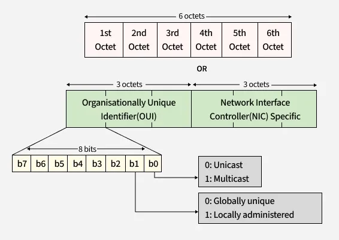
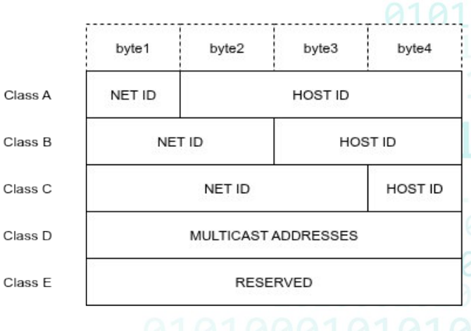
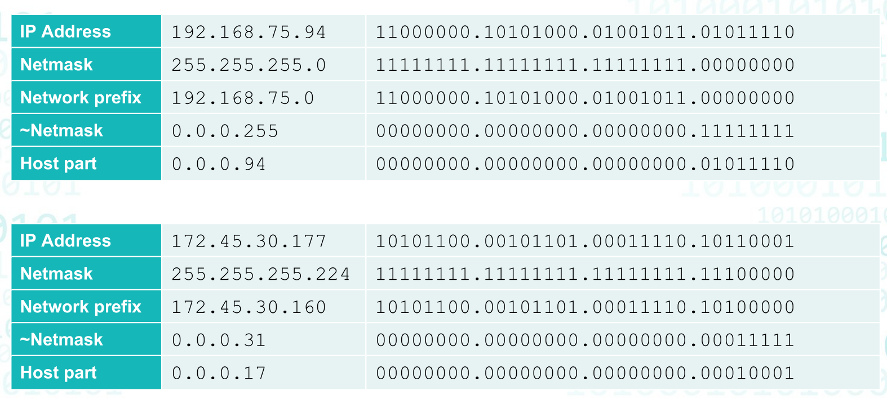
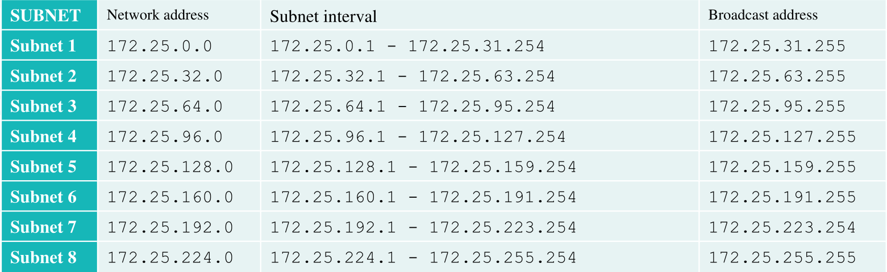

# Adresare. Adrese MAC. Adrese IP

# Adresa MAC

- ajută la identificarea device-urilor din aceeași rețea.
- este specifică pentru layer 2 din stiva OSI.
- este o adresă scrisă în hardware și se poate modifica.
- sunt gestionate de IEEE.
- sunt reprezentate prin intermediul standardului EUI-48 și mai puțin EUI-64.
- dacă prin absurd am duplicat de MAC, dar se află fiecare în altă rețea nu afecteză.

- ***1: Multicast*** - rezervat pentru anumite protocoale.
- ***1: Locally administered*** - îi o mașină virtuală/docker/etc, nu îi ceva fizic!!!!
- FF:FF:FF:FF:FF:FF - este adresă de broadcast și este folosit de DHCP și ARP.

---

# Adresa IP

- este specifică layer-ului 3 din stiva OSI.
- pentru a identifica dispozitivele din altă rețea.
- avem IPv4 și IPv6.
- IPv6 este foarte nesigur și are multe bug-uri.
- IPv4 este reprezentat pe 32 bits sau 4 bytes.
- IPv6 este reprezentat pe 128 bits sau 32 bytes.
- sunt gestionate de IANA:
	- AFRINIC - Africa
	- APNIC - Asia
	- ARIN - America de Nord
	- LACNIC - America Latină și Caraibe
	- RIPE NCC - Europa, Orientul Mijlociu și Asia Centrală

- Net ID -> pentru rețea.
- Host ID -> îți indentifică dispozitivul.

---

# Adresarea IP

- subnet-urile sunt separate prin software.
- rooting prefix și hosting sufix.

## 255.255.255.0 = 1111 1111.1111 1111.1111 1111.0000 0000

                   |________________________________________||____________|
                     prefix pentru retea                       host

- regula spune că trebuie să avem o succesiune de biții de 1 neîntrerupți, urmați de o secvență de 0-uri.

## IP Address & Netmask = Network prefix

## IP Address & ~ Netmask = Host part

## adresa IP / mask -> 192.168.75.94/24

## 0.0.0.0 -> este o notație ca fiind toate interfețele pe care să asculte.

## Adrese private:

- 10.0.0.0/8 (10.0.0.0 - 10. 255.255.255) - Clasa A
- 172.16.0.0/12 (172.16.0.0 - 172.31.255.255) - Clasa B
- 192.168.0.0/16 (192.168.0.0 - 192.168.255.255) - Clasa C

---

# Calculul unui subnet: 172.25.167.98/19

## Pasul 1: Stabilim clasa de baza

- /24 ar fi mult prea restrictiv.
- /16 sau /8, unde /8 este mult prea mare.
- deci /16 este cel mai bun.

## Pasul 2: Calculam numarul de host-uri per subnet

# $\text hostcount = 2^{32-\text{CIDR\_bits}} - 2 = 2^{32-19} - 2 = 2^{13} - 2 = 8192 - 2 = 8190$

- scadem adresa de retea si cea de broadcast.

## Pasul 3: Calculam numarul de subnet-uri

# $\text{borrowedbits} = \text{newCIDR} - \text{baseCIDR} = 19 - 16 = 3$

# $\text{subnets} = 2^{\text{newCIDR}-\text{baseCIDR}} = 2^{19-16} = 2^3 = 8$

## Pasul 4: determinare intervale

### $\text 8190 + 1 + 1 = 8192$
### $\text 8192 / 256 - 1 = 31$

