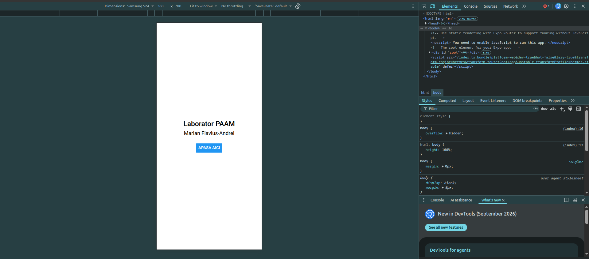

# Laborator 1 - PAAM

Prima aplicație mobilă cu Expo (React Native + TypeScript).

## Descriere

Aplicația afișează un ecran cu textul „Laborator PAAM”, numele autorului și un buton „Apasă aici”. La apăsarea butonului, textul de pe ecran se schimbă cu „Salut din React Native!”.

## Componente folosite

- `View` - container pentru conținut; unul centrează totul pe ecran, altul creează spațiul dintre text și buton
- `Text` - afișează textele
- `Button` - butonul cu eticheta „Apasă aici”
- `useState` - ține mesajul curent; la schimbarea lui, ecranul se actualizează
- `onPress` - funcția apelată la apăsarea butonului (`setMesaj`)
- `StyleSheet` - stilurile (centrare cu `flex`, `justifyContent`, `alignItems`; spațiu cu `height`)

## Rulare

```bash
cd LucrareLab1
npm install
npx expo start --web
```

Aplicația se deschide la `http://localhost:8081`. Pe telefon se scanează codul QR cu Expo Go (`npx expo start`).

## Capturi de ecran

| Ecran principal | După apăsarea butonului |
| --- | --- |
|  |  |

## Structură

- `LucrareLab1/App.tsx` - codul sursă al aplicației
- `ecran1.png`, `ecran2.png` - capturile de ecran
